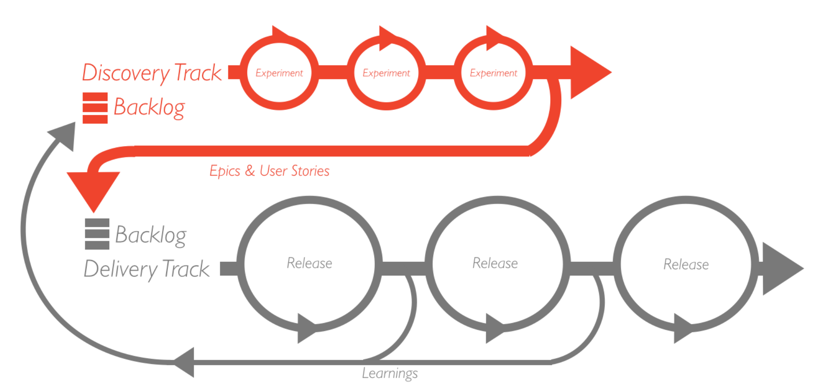

# **Processo de Desenvolvimento de Software**

??? abstract "Histórico de Revisão"

    | **Data** | **Versão** |                        **Descrição**                         |                                      **Autor**                                       |
    | :------: | :--------: | :----------------------------------------------------------: | :----------------------------------------------------------------------------------: |
    |  08/11   |    1.0     | Criação das seção de Processo de desenvolvimento de software | Erick Miranda Santos   Maykon Júnio dos Santos Soares   Marllon Fausto Cardoso   Pedro Miguel M. de O. dos Santos |
    |  10/11   |    1.1     | Especificação do processo de desenvolvimento | Erick Miranda Santos |

---

## **Ciclo de vida**

| Requisitos                                                  | Waterfall              | Protótipo              | Iterativo              | Evolucionário          | Espiral                | RAD                    |
| ----------------------------------------------------------- | ---------------------- | ---------------------- | ---------------------- | ---------------------- | ---------------------- | ---------------------- |
| Os requisitos são fáceis de entender e definir?             | :x: Sim                | :white_check_mark: Não | :white_check_mark: Não | :white_check_mark: Não | :white_check_mark: Não | :x: Sim                |
| Mudamos os requisitos com bastante frequência?              | :white_check_mark: Não | :x: Sim                | :white_check_mark: Não | :white_check_mark: Não | :x: Sim                | :white_check_mark: Não |
| Podemos definir os requisitos no início do ciclo?           | :white_check_mark: Sim | :x: Não                | :white_check_mark: Sim | :white_check_mark: Sim | :x: Não                | :white_check_mark: Sim |
| Os requisitos indicam um sistema complexo a ser construído? | :white_check_mark: Não | :x: Sim                | :x: Sim                | :x: Sim                | :x: Sim                | :white_check_mark: Não |
| **Total**                                                   | 3                      | 1                      | 3                      | 3                      | 1                      | 3                      |

| Equipe de Desenvolvimento                              | Waterfall              | Protótipo              | Iterativo              | Evolucionário          | Espiral | RAD                    |
| ------------------------------------------------------ | ---------------------- | ---------------------- | ---------------------- | ---------------------- | ------- | ---------------------- |
| Pouca experiência em projetos similares                | :white_check_mark: Não | :x: Sim                | :white_check_mark: Não | :white_check_mark: Não | :x: Sim | :white_check_mark: Não |
| Pouco conhecimento de domínio (novidade na tecnologia) | :x: Sim                | :white_check_mark: Não | :x: Sim                | :x: Sim                | :x: Sim | :white_check_mark: Não |
| Pouca experiência com as ferramentas a serem usadas    | :x: Sim                | :white_check_mark: Não | :white_check_mark: Não | :white_check_mark: Não | :x: Sim | :white_check_mark: Não |
| Disponibilidade de treinamento, se necessário          | :x: Não                | :x: Não                | :white_check_mark: Sim | :white_check_mark: Sim | :x: Não | :white_check_mark: Sim |
| **Total**                                              | 1                      | 2                      | 3                      | 3                      | 0       | 4                      |

| Envolvimento dos usuários                                              | Waterfall              | Protótipo              | Iterativo              | Evolucionário | Espiral | RAD                    |
| ---------------------------------------------------------------------- | ---------------------- | ---------------------- | ---------------------- | ------------- | ------- | ---------------------- |
| Envolvimento dos usuários em todas as fases                            | :x: Não                | :white_check_mark: Sim | :x: Não                | :x: Não       | :x: Não | :white_check_mark: Sim |
| Participação limitada do usuário                                       | :x: Sim                | :white_check_mark: Não | :x: Sim                | :x: Sim       | :x: Sim | :white_check_mark: Não |
| Usuário sem experiência anterior de participação em projetos similares | :white_check_mark: Não | :x: Sim                | :x: Sim                | :x: Sim       | :x: Sim | :white_check_mark: Não |
| Usuários são especialistas no domínio do problema                      | :x: Não                | :white_check_mark: Sim | :white_check_mark: Não | :x: Não       | :x: Não | :white_check_mark: Sim |
| **Total**                                                              | 1                      | 3                      | 1                      | 0             | 0       | 4                      |

| Tipo de Projeto e Risco                                    | Waterfall              | Protótipo              | Iterativo              | Evolucionário          | Espiral                | RAD                    |
| ---------------------------------------------------------- | ---------------------- | ---------------------- | ---------------------- | ---------------------- | ---------------------- | ---------------------- |
| O projeto é uma melhoria de um sistema existente           | :white_check_mark: Não | :white_check_mark: Não | :x: Sim                | :x: Sim                | :white_check_mark: Não | :x: Sim                |
| O financiamento é estável para o projeto                   | :white_check_mark: Sim | :white_check_mark: Sim | :x: Não                | :x: Não                | :x: Não                | :white_check_mark: Sim |
| Altos requisitos de confiabilidade                         | :x: Não                | :x: Não                | :white_check_mark: Sim | :white_check_mark: Sim | :white_check_mark: Sim | :x: Não                |
| Cronograma apertado do projeto                             | :x: Não                | :white_check_mark: Sim | :white_check_mark: Sim | :white_check_mark: Sim | :white_check_mark: Sim | :white_check_mark: Sim |
| Uso de componentes reutilizáveis                           | :x: Não                | :white_check_mark: Sim | :x: Não                | :x: Não                | :white_check_mark: Sim | :white_check_mark: Sim |
| Os recursos (tempo, dinheiro, pessoas, etc.) são escassos? | :x: Não                | :white_check_mark: Sim | :x: Não                | :x: Não                | :white_check_mark: Sim | :x: Não                |
| **Total**                                                  | 2                      | 5                      | 2                      | 2                      | 5                      | 3                      |

| Conclusão                 | Waterfall | Protótipo | Iterativo | Evolucionário | Espiral | RAD                   |
| ------------------------- | --------- | --------- | --------- | ------------- | ------- | --------------------- |
| Requisitos                | 3         | 1         | 3         | 3             | 1       | 3                     |
| Equipe de Desenvolvimento | 1         | 2         | 3         | 3             | 0       | 4                     |
| Envolvimento dos usuários | 1         | 3         | 1         | 0             | 0       | 4                     |
| Tipo de Projeto e Risco   | 2         | 5         | 2         | 2             | 5       | 3                     |
| **Total**                 | :x: 7     | :x: 11    | :x: 9     | :x: 8         | :x: 6   | :white_check_mark: 14 |

---

## **Etapas do RAD**

### **Etapa 1 - Planejamento dos requisitos**

Na etapa de planejamento dos requisitos, fazemos uma análise completa do cenário e elicitamos os requisitos, nesse projeto nós seguimos o material do Professor George Marsicano(2023)[4], por isso nós seguimos os pontos, Descoberta e elicitação de requisitos, Análise e consenso de requisitos, Declaração de requisitos, Verificação e Validação e por último a Organização e atualização.

| Atividade                             | Método                          | Ferramenta  | Entrega                               |
| ------------------------------------- | ------------------------------- | ----------- | ------------------------------------- |
| Descoberta e elicitação de requisitos | Diagrama de causa e 5 porquês   | Trello      | Backlog de requisitos não validado    |
| Análise e consenso de requisitos      | Análise de viabilidade          | Teams       | Backlog de requisitos não validado    |
| Declaração                            | Épicos, Features e User Stories | Trello      | User Stories não validado             |
| Verificação e Validação               | Feedback                        | Google Meet | User Stories validados                |
| Organização e Atualização             | MoSCoW e Kanban                 | Trello      | Definição de prioridades(MVP1 e MVP2) |

### **Etapa 2 - User Design**

Na etapa de User Design, é feito a prototipação da aplicação, no caso é feito o protótipo equivalente aos User Stories relacionados ao MVP1 na terceira unidade e ao MVP2 na quarta unidade.

| Etapa        | Método          | Ferramenta | Entregas                     |
| ------------ | --------------- | ---------- | ---------------------------- |
| Prototipação | Mock-up digital | Figma      | Protótipo de alta fidelidade |

### **Etapa 3 - Desenvolvimento**

Na etapa de desenvolvimento é onde é feito o projeto e seu código é desenvolvido, esta etapa irá ocorrer ao mesmo tempo que a etapa de User Design, com isso, o desenvolvimento ocorrerá ao mesmo tempo com a prototipação.

| Etapa           | Método                      | Ferramenta      | Entregas |
| --------------- | --------------------------- | --------------- | -------- |
| Desenvolvimento | Dual-track Agile (adaptado) | VS Code, Github | Produto  |

#### **Dual-track Agile**

Dual-Track Agile é uma abordagem que divide o processo de desenvolvimento de software em duas trilhas paralelas: Descoberta (Discovery) e Entrega (Delivery). Essa metodologia visa equilibrar a inovação e a validação contínua com a implementação eficiente, garantindo que o que está sendo construído atenda às necessidades reais dos usuários e do negócio.

/// caption
Representação gráfica de processo dual-track Agile.
///

!!! Tip "Dual-track Agile (adaptado)"

    
Dual-Track Agile (adapatado) é um abordagem que vai dividir o processo de desenvolvimento de software em duas trilhas paralela:

    
Desenvolvimento e Testes. Fazendo uma entrega contínua que visa otimizar desenvolvimento e validação, com uma implementação eficiente.

### **Etapa 4 - Testes**

Na etapa de testagem será feito os testes de todas as funcionalidades da aplicação

| Etapa    | Método                              | Ferramenta            | Entregas        |
| -------- | ----------------------------------- | --------------------- | --------------- |
| Testagem | Testes Unitários, Testes End-to-end | Jest, Pytest, Cypress | Produto testado |
